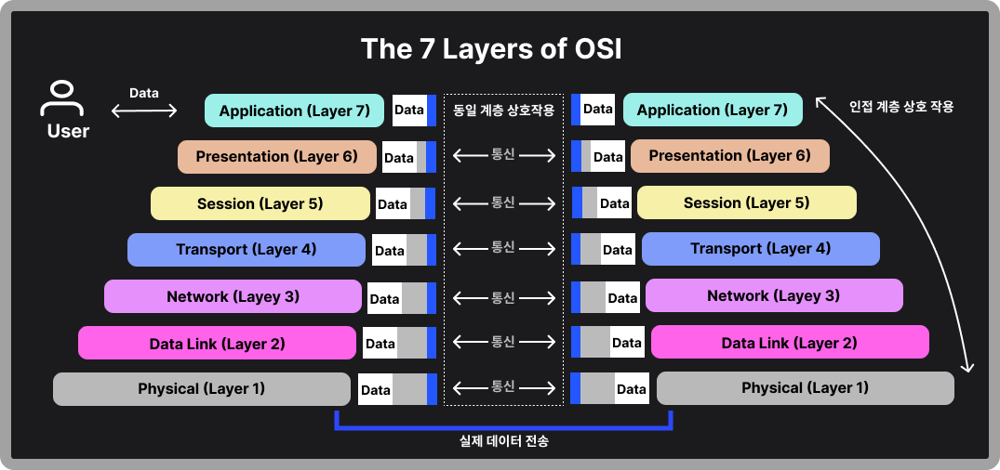

> 네트워크에서 다양한 기기들이 서로 연결되어 정보를 주고받는 상황에서, 효율적이고 안정적인 통신을 위해서는 표준화된 모델이 필요합니다. 이러한 필요성에 의해 OSI 7계층 모델과 TCP/IP 4계층 모델이 개발되었습니다. 이 글에서 OSI 7 Layer와 TCP/IP Layer에 대해서 알아보겠습니다.

## OSI 7계층 모델이란?

OSI(Open Systems Interconnection) 모델은 국제표준화기구(ISO)에서 개발한 표준 네트워크 아키텍처입니다. 이 모델은 네트워크 통신을 7개의 계층으로 나누어 각 계층의 역활과 책임을 명확히 정의합니다.

## OSI 각 계층별 역활

- 응용 계층(Application Layer):  
응용 계층은 사용자의 데이터와 직접 상호 작용하는 유일한 계층으로, 응용 프로그램 간의 데이터 교환을 담당합니다. 

- 표현 계층(Presentation Layer):  
표현 계층은 데이터의 형식을 정의하고 암호화, 압축 등을 담당합니다. 서로 통신하는 장치들의 인코딩 방법이 다를 수 있으므로 응용 계층이 이해할 수 있게 수신 데이터를 변환하는 일을 담당합니다. 또한 데이터를 세션 계층에 보내기 전에 압축하여 전송할 데이터 양을 최소화하여 통신의 속도와 효율을 높이는 역활을 합니다.

- 세션 계층(Session Layer):  
세션 계층은 다른 기기와의 통신을 관리하기 위한 방법을 제공합니다. 통신을 시작하고 종료하는 일을 담당하며, 이는 데이터를 모두 전송하고 리소스를 낭비하지 않게 해줍니다. 또한 데이터 전송에 체크 포인트를 두어 파일이 전송되다 중간에 연결이 끊기는 경우 체크 포인트에서 세션을 다시 시작하는 것이 가능합니다.

- 전송 계층(Transport Layer):  
전송 계층은 종단간 신뢰성 있는 데이터 전송을 담당합니다. TCP와 UDP 프로토콜이 이 계층에서 동작합니다. 세션 계층에서 데이터를 가져와 네트워크 계층에 보내기 전에 세그먼트 단위로 데이터를 분할하여 전송합니다. 

> 데이터를 세그먼트로 쪼개는 이유는 오류 제어, 흐름 제어, 신뢰성 향상, 다중화 지원을 하여 효율적이고 신뢰성 있는 데이터 전송을 보장하기 위함입니다.
{: .prompt-info }

- 네트워크 계층(Network Layer):  
전송 계층에서 보낸 세그먼트를 받아 이를 효율적으로 처리하고 목적지까지 전달하는 네트워크 계층은 데이터 전송을 위한 경로를 선택하고 IP 주소를 정의합니다. 네트워크 계층은 서로 다른 두 네트워크 간 데이터 전송을 용이하게 하는 역활을 합니다. 라우터가 이 계층에서 동작합니다.

> 데이터(패킷)가 표적에 도달하기 위한 최적화된 경로를 찾기 위한 라우팅 알고리즘을 이용합니다. 경로가 결정되면 포워딩을 통해 다음 라우터로 전달하고 최종 목적지에서는 패킷을 재조립합니다.
{: .prompt-info }

- 데이터 링크 계층(Date Link Layer):  
이 계층은 물리 계층을 통해 송수신되는 정보의 오류와 흐름을 관리합니다. 동일한 네트워크에 있는 두 개의 장치 간 데이터 전송을 용이하게 하는 역활을 합니다. 이더넷 프로토콜이 이 계층에서 동작합니다.

- 물리 계층(Physical Layer):  
물리 계층은 실제 데이터의 전기적, 기계적 전송을 담당합니다. 또한 1과 0의 문자열로 이루어져 있는 비트 스트림으로 변환되는 계층입니다. 케이블, 허브, 리피터 등의 장비가 이 계층에서 동작합니다.

OSI 모델의 장점은 각 계층이 독립적이어서 유지보수가 용이하다는 것이지만, 실제 구현이 복잡하다는 단점이 있습니다.

## TCP/IP 4계층 모델

TCP/IP 모델은 실제 인터넷에서 사용되는 프로토콜 스택을 기반으로 만들어진 모델입니다. OSI 모델보다 단순화되어 4개의 계층으로 구성됩니다. 각 계층은 OSI 계층과 같이 특정 기능을 담당합니다.

## TCP/IP 각 계층별 설명

- 응용 계층(Application Layer):  
사용자의 데이터와 직접 상호 작용하는 유일한 계층으로, 응용 프로그램 간 데이터 교환을 담당합니다. OSI 모델의 응용, 표현, 세션 계층의 기능을 포함하여 다양한 네트워크 서비스와 응용 프로그램의 기반을 제공합니다. 주요 프로토콜은 다음과 같습니다.

- HTTP(웹 브라우징): 클라이언트와 서버 간 하이퍼텍스트 문서를 주고받는 데 사용됩니다. 웹 페이지, 이미지, 비디오 등 다양한 리소스 전송에 활용합니다.
- SMTP, POP3, IMAP(이메일): 이메일 전송을 위한 프로토콜로 메일 서버 간 이메일 송수신에 사용됩니다.
- FTP(파일 전송): 클라이언트와 서버 간 파일 업로드 및 다운로드에 사용됩니다.
- DNS(도메인 이름 해석): 도메인 이름을 IP 주소로 변환하는 프로토콜로 일반적으로 UDP를 사용하지만, DNS 서버 간 동기화 시 TCP를 사용합니다.
- SNMP(네트워크 관리): 네트워크 장치 관리 및 모니터링을 위한 프로토콜입니다.

- 전송 계층(Transport Layer):  
OSI 모델의 전송 계층과 동일한 역활을 합니다. 데이터를 세그먼트로 분할하고 기기 간의 연결 관리, 오류 검출 및 복구, 흐름 제어 및 혼잡 제어를 담당합니다. TCP와 UDP 프로토콜이 이 계층에서 동작합니다.

- 인터넷 계층(Internet Layer):  
OSI 모델의 네트워크 계층에 해당합니다. 데이터 패킷의 라우팅과 논리적 주소 지정을 담당합니다. IP, ICMP, ARP 등의 프로토콜이 이 계층에서 동작합니다.

- 네트워크 연결 계층 (Network Access Layer):  
네트워크 연결 계층은 TCP/IP 모델의 최하위 계층으로, 물리적인 네트워크 연결과 데이터 전송을 담당합니다. 

    - 주요 기능
        - 물리적 네트워크 하드웨어와의 인터페이스
        - 데이터 프레임의 생성 및 전송
        - 물리적 주소 지성(MAC 주소 사용)
    - 주요 프로토콜
        - Ethernet
        - Wi-Fi
        - PPP(Point-to-Point Protocol)
        - Frame Relay

TCP/IP 모델의 장점은 실제 인터넷 환경에 최적화되어 있다는 것이지만, OSI 모델에 비해 계층 구분이 명확하지 않다는 단점이 있습니다.

## OSI 모델과 TCP/IP 모델 비교

두 모델의 주요 차이점은 계층의 수와 각 계층의 역활 분담입니다.  OSI 모델이 더 세분화되어 있지만, TCP/IP 모델이 실제 인터넷 환경에 더 잘 맞습니다. 그러나 두 모델 모두 네트워크 통신의 기본 원리를 이해하는 데 중요한 역활을 합니다.

- 구조적 차이점
- 기능적 유사성
- 실제 적용에서의 차이

## 실제 네트워크 통신에서의 적용

실제 네트워크 통신에서는 데이터가 상위 계층에서 하위 계층으로 전달되면서 각 계층의 헤더가 추가되는 캡슐화 과정과, 수신 측에서 이를 역으로 해석하는 역캡슐화 과정이 일어납니다. 이 과정을 통해 복잡한 네트워크 통신이 가능해집니다.

|특성|OSI 모델|TCP/IP 모델|
|:--|:--|:--|
|계층 수|7개 계층|4개 계층|
|개발|ISO에 의해 개발된  이론적 프레임워크|DARPA에 의해 개발된  실용적 프레임워크|
|목적|범용 통신 시스템을 위한  개념적 모델|인터넷 통신을 위한  실제 프로토콜 스택|
|프로토콜 독립성|프로토콜 독립적|특정 프로토콜(TCP/IP)에 기반|
|계층 구분|서비스, 인터페이스,프로토콜 각 계층에서 명확히 구분|일부 OSI 계층 기능을 통합|
|신뢰성|상대적으로 덜 신뢰적|더 신뢰적|
|사용 및 채택|주로 참조 모델로 사용|실제 네트워크 구현에 널리 사용|
|유연성|프로토콜 교체가 용이|프로토콜 교체가 어려움|
|문제 해결|더 세분화된 계층으로 문제 해결이 용이|통합된 계층으로 인해  문제 해결이 상대적으로 복잡|
|접근 방식|수직적 접근|수평적 접근|

### 데이터 캡슐화와 역캡슐화 과정

데이터 캡슐화와 역캡슐화는 

#### 데이터 캡슐화(Encapsulation)

데이터가 송신 호스트의 상위 계층에서 하위 계층으로 이동하면서 각 계층의 헤더를 추가하는 과정입니다.

1. 응용 계층: 사용자 데이터 생성
2. 전송 계층: TCP 또는 UDP 헤더 추가
3. 네트워크 계층: IP 헤더 추가
4. 데이터 링크 계층: 프레임 헤더와 트레일러 추가
5. 물리 계층: 데이터를 전기 신호나 광 신호로 변환하여 전송 

> 각 계층에서 추가되는 헤더에는 해당 계층의 프로토콜이 필요로 하는 정보가 포함됩니다.
{: .prompt-info }

#### 데이터 역캡슐화(Decapsulation)

역캡슐화는 수신 호스트에서 일어나는 과정으로, 하위 계층에서 상위 계층으로 데이터가 이동하면서 각 계층의 헤더를 제거하는 과정입니다.

1. 물리 계층: 전기 신호를 디지털 데이터로 변환
2. 데이터 링크 계층: 프레임 헤더와 트레일러 제거
3. 네트워크 계층: IP 헤더 제거
4. 전송 계층: TCP 또는 UDP 헤더 제거
5. 응용 계층: 최종 사용자 데이터 처리 

각 계층은 송신 호스트가 추가한 헤더의 정보를 읽고 해당 프로토콜의 기능을 실현한 후, 사용한 헤더를 삭제하고 상위 계층으로 데이터를 전달합니다.

## 마치며

OSI 7계층과 TCP/IP 4계층 모델은 네트워크 통신의 기본 구조를 이해하는 데 필수적인 개념입니다. 이들 모델은 현대 네트워크 기술의 발전에 큰 영향을 미쳤으며, 앞으로도 새로운 네트워크 기술의 개발과 표준화에 중요한 역활을 할 것으로 예상됩니다.